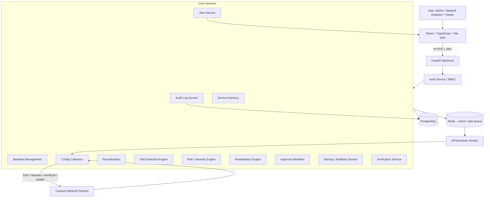
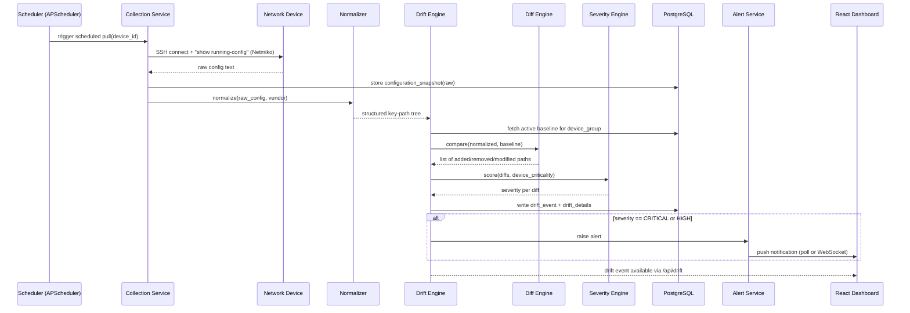
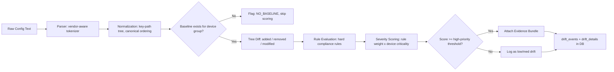
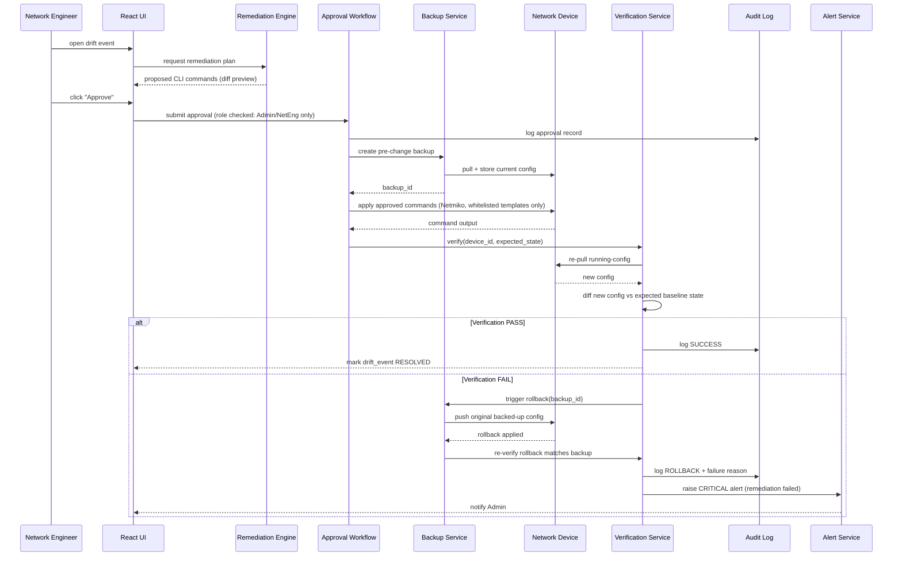
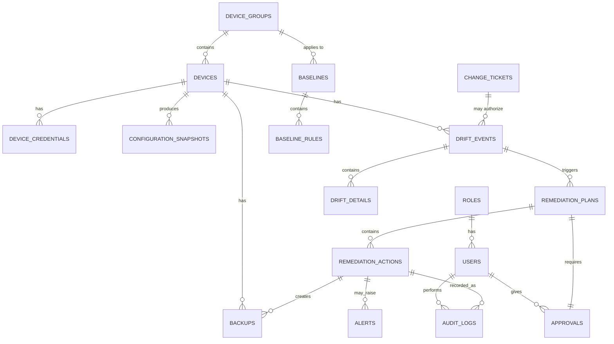
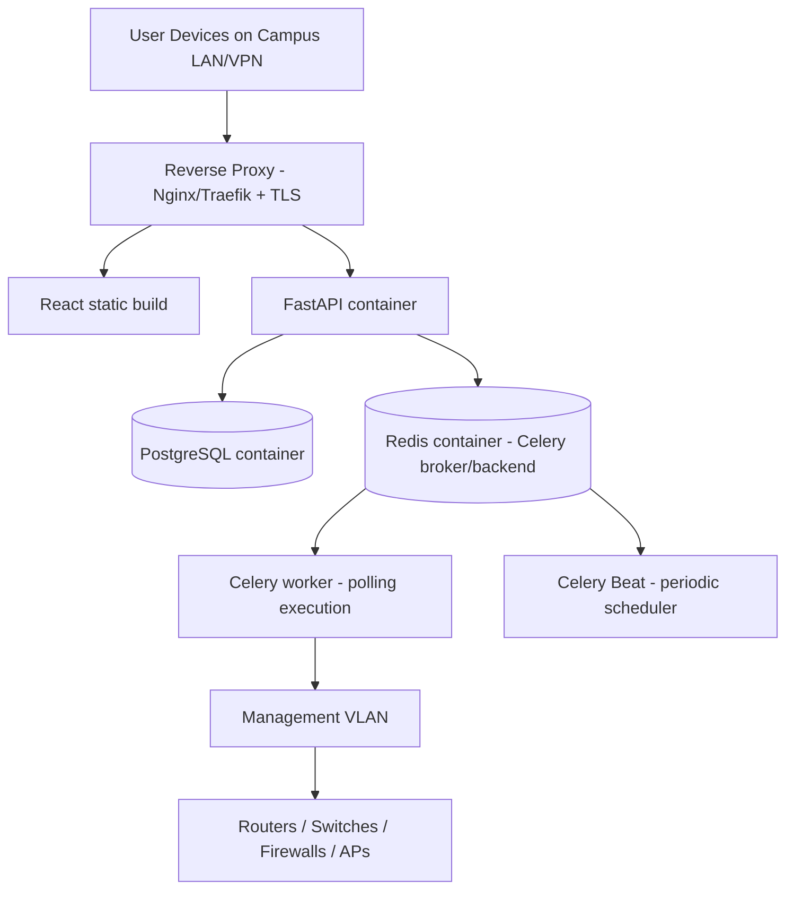
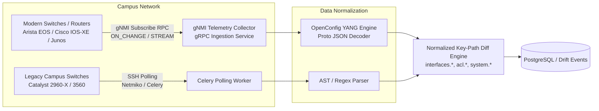

# Network Configuration-Drift Detector — Complete System Architecture
### Campus Network (Classrooms / Hostels / Offices / Labs / Public Events)

---

## 1. Architecture Overview

This is a **3-layer, monolith-first architecture** — one FastAPI backend, one React SPA, one Postgres database, one background worker process — deliberately *not* microservices. It is designed so a 3–5 person student team can build, demo, and defend it in a semester, while still being realistic enough to point at a real campus network later (Netmiko/NAPALM over SSH to real or simulated gear).

Core idea: **collect → normalize → compare → score → explain → approve → remediate → verify → rollback → audit**, with a human in the loop at every state-changing step. Detection is read-only and safe to run continuously; remediation is gated behind RBAC + explicit approval + backup + verification, so the system can never silently push config to a live device.

Two operating strategies coexist deliberately: devices can be polled on a schedule (drift *detection*), and engineers can trigger on-demand pulls (e.g., before a maintenance window). Both paths converge on the same Diff/Severity engine so there's one source of truth for "what is drift."

---

## 2. High-Level Architecture Diagram



**Flow in words:** User hits the SPA → SPA calls FastAPI with a JWT → RBAC middleware checks role → request reaches the relevant service → services read/write Postgres and, for device-facing work, go through the Collection/Remediation services which speak SSH/Netmiko to real devices → results flow back through Alerts/Audit into the dashboard.

---

## 3. Detailed Component Architecture

| Component | Responsibility | Inputs | Outputs | Tech | Exposes / Uses | DB Tables |
|---|---|---|---|---|---|---|
| **Auth Service** | Login, JWT issue/refresh, RBAC checks | credentials | JWT, role claims | FastAPI, `python-jose`, `passlib` (bcrypt) | `/api/auth/*` | `users`, `roles` |
| **Device Inventory Service** | CRUD devices, group by campus area | device metadata | device records | FastAPI, SQLAlchemy | `/api/devices/*` | `devices`, `device_credentials`, `device_groups` |
| **Baseline Management Service** | CRUD baselines & rules, versioning | YAML/JSON baseline defs | stored baseline version | FastAPI, Pydantic | `/api/baselines/*` | `baselines`, `baseline_rules` |
| **Configuration Collection Service** | Pull running-config from a device | device creds + IP | raw config text + metadata | Netmiko / NAPALM, SNMP (status only) | internal, called by Scheduler/API | `configuration_snapshots` |
| **Normalization Service** | Turn raw CLI text into a structured key-path tree | raw config | normalized dict/tree | custom parser + `ciscoconfparse` (optional) | internal | (in-memory, cached to snapshot) |
| **Drift Detection Engine** | Compare normalized config to baseline | normalized config, baseline | list of diffs | custom diff logic (tree diff, not text diff) | internal | `drift_events`, `drift_details` |
| **Risk / Severity Engine** | Score each diff by rule weight + device criticality | diffs, rule metadata | severity label + numeric score | rule-weighted scoring function | internal | `drift_events` (severity fields) |
| **Remediation Engine** | Turn an approved diff into safe, reversible CLI commands | drift_event, baseline | remediation plan (command list) | Jinja2 templated command generation | `/api/remediation/*` | `remediation_plans`, `remediation_actions` |
| **Approval Workflow** | Gate remediation behind explicit sign-off | remediation plan | approval record | FastAPI + RBAC | `/api/approvals/*` | `approvals` |
| **Backup / Rollback Service** | Snapshot config before change; restore on failure | device | backup record, rollback config | Netmiko | internal, `/api/remediation/{id}/rollback` | `backups` |
| **Verification Service** | Re-pull config after change, confirm it matches intent | device | pass/fail + new snapshot | reuses Collection + Diff | internal | `configuration_snapshots`, `remediation_actions` |
| **Alert Service** | Notify on critical drift / failures | events from Drift/Remediation | in-app alert, optional email/webhook | FastAPI background tasks | `/api/alerts/*` | `alerts` |
| **Audit Log Service** | Immutable trail of every state-changing action | actions from every service | append-only log rows | SQLAlchemy | `/api/audit/*` | `audit_logs` |
| **Scheduler/Worker** | Periodic device polling, retries | cron-like schedule | triggers Collection Service | **APScheduler** (see §15 for why not Celery) | internal | `configuration_snapshots` |

---

## 4. Configuration Collection Flow (Sequence Diagram)



**Failure branch:** if SSH connect fails, `COLL` catches the exception, marks the device `UNREACHABLE`, logs to `audit_logs`, raises a `DEVICE_UNREACHABLE` alert, and the scheduler retries with backoff (see §11).

---

## 5. Drift Detection Flow (Pipeline View)



---

## 6. Remediation & Rollback Flow (Sequence Diagram)



This is exactly the **rollback demonstration** the assignment requires: it is a first-class path, not an afterthought, and it is triggered automatically on verification failure, not just manually.

---

## 7. Database ER Diagram



---

## 8. Database Schema

**users**
| Column | Type | Key | Notes |
|---|---|---|---|
| id | UUID | PK | |
| username | VARCHAR(64) | UNIQUE, indexed | |
| password_hash | VARCHAR(255) | | bcrypt |
| role_id | UUID | FK → roles.id | |
| is_active | BOOLEAN | | |
| created_at | TIMESTAMP | | |

**roles**
| Column | Type | Key | Notes |
|---|---|---|---|
| id | UUID | PK | |
| name | VARCHAR(32) | UNIQUE | Admin / NetworkEngineer / Viewer |

**device_groups**
| Column | Type | Key | Notes |
|---|---|---|---|
| id | UUID | PK | |
| name | VARCHAR(64) | | Classroom / Hostel / Office / Lab / PublicEvent |
| criticality_weight | FLOAT | | used in severity scoring |

**devices**
| Column | Type | Key | Notes |
|---|---|---|---|
| id | UUID | PK | |
| hostname | VARCHAR(128) | indexed | |
| ip_address | VARCHAR(45) | indexed | v4/v6 |
| vendor | VARCHAR(32) | | cisco_ios, juniper_junos, frr, etc. |
| model | VARCHAR(64) | | |
| device_group_id | UUID | FK → device_groups.id | |
| status | VARCHAR(16) | | ONLINE / UNREACHABLE / DECOMMISSIONED |
| last_polled_at | TIMESTAMP | | |

**device_credentials**
| Column | Type | Key | Notes |
|---|---|---|---|
| id | UUID | PK | |
| device_id | UUID | FK → devices.id | |
| username_enc | BYTEA | | encrypted at rest (Fernet/KMS) |
| secret_ref | VARCHAR(255) | | pointer to vault/secret store, **never plaintext in DB** |
| auth_type | VARCHAR(16) | | password / ssh_key |

**baselines**
| Column | Type | Key | Notes |
|---|---|---|---|
| id | UUID | PK | |
| name | VARCHAR(128) | | |
| device_group_id | UUID | FK → device_groups.id | |
| vendor | VARCHAR(32) | | |
| version | INT | | incremented on edit, immutable history |
| is_active | BOOLEAN | indexed | only one active version per group+vendor |
| created_by | UUID | FK → users.id | |
| created_at | TIMESTAMP | | |

**baseline_rules**
| Column | Type | Key | Notes |
|---|---|---|---|
| id | UUID | PK | |
| baseline_id | UUID | FK → baselines.id | |
| key_path | VARCHAR(255) | | e.g. `interface.*.port_security.enabled` |
| expected_value | TEXT | | |
| rule_type | VARCHAR(16) | | EXACT / REGEX / MUST_EXIST / MUST_NOT_EXIST |
| severity_weight | INT | | 1–100, drives risk score |
| hard_compliance | BOOLEAN | | true = violates regardless of ticket |

**configuration_snapshots**
| Column | Type | Key | Notes |
|---|---|---|---|
| id | UUID | PK | |
| device_id | UUID | FK, indexed | |
| raw_config | TEXT | | |
| normalized_json | JSONB | | indexed with GIN for querying |
| collected_at | TIMESTAMP | indexed | |
| collection_method | VARCHAR(16) | | SSH / API / MANUAL_UPLOAD |

**change_tickets**
| Column | Type | Key | Notes |
|---|---|---|---|
| id | UUID | PK | |
| ticket_ref | VARCHAR(64) | UNIQUE | external ITSM ref if any |
| device_id | UUID | FK, nullable | nullable = applies to a group |
| device_group_id | UUID | FK, nullable | |
| key_path_scope | VARCHAR(255) | | which config area it authorizes |
| valid_from | TIMESTAMP | | |
| valid_to | TIMESTAMP | | matching window used by Ticket Matcher |
| status | VARCHAR(16) | | OPEN / CLOSED |

**drift_events**
| Column | Type | Key | Notes |
|---|---|---|---|
| id | UUID | PK | |
| device_id | UUID | FK, indexed | |
| snapshot_id | UUID | FK → configuration_snapshots.id | |
| baseline_id | UUID | FK → baselines.id | |
| label | VARCHAR(32) | indexed | see §12 label taxonomy |
| risk_score | INT | indexed | 0–100 |
| matched_ticket_id | UUID | FK, nullable | |
| status | VARCHAR(16) | | OPEN / ACK / RESOLVED / FALSE_POSITIVE |
| detected_at | TIMESTAMP | indexed | |

**drift_details**
| Column | Type | Key | Notes |
|---|---|---|---|
| id | UUID | PK | |
| drift_event_id | UUID | FK, indexed | |
| key_path | VARCHAR(255) | | |
| expected_value | TEXT | | |
| actual_value | TEXT | | |
| change_type | VARCHAR(16) | | ADDED / REMOVED / MODIFIED |
| rule_id | UUID | FK → baseline_rules.id, nullable | |

**remediation_plans**
| Column | Type | Key | Notes |
|---|---|---|---|
| id | UUID | PK | |
| drift_event_id | UUID | FK | |
| proposed_commands | TEXT[] | | generated CLI, whitelisted templates only |
| status | VARCHAR(16) | | PENDING / APPROVED / REJECTED / APPLIED |
| created_at | TIMESTAMP | | |

**approvals**
| Column | Type | Key | Notes |
|---|---|---|---|
| id | UUID | PK | |
| remediation_plan_id | UUID | FK | |
| approved_by | UUID | FK → users.id | role must be Admin/NetEng |
| decision | VARCHAR(16) | | APPROVED / REJECTED |
| comment | TEXT | | |
| decided_at | TIMESTAMP | | |

**remediation_actions**
| Column | Type | Key | Notes |
|---|---|---|---|
| id | UUID | PK | |
| remediation_plan_id | UUID | FK | |
| executed_commands | TEXT[] | | |
| result | VARCHAR(16) | | SUCCESS / FAILED / ROLLED_BACK |
| verification_snapshot_id | UUID | FK, nullable | |
| executed_at | TIMESTAMP | | |

**backups**
| Column | Type | Key | Notes |
|---|---|---|---|
| id | UUID | PK | |
| device_id | UUID | FK, indexed | |
| config_blob | TEXT | | full config captured pre-change |
| taken_at | TIMESTAMP | | |
| taken_before_action_id | UUID | FK → remediation_actions.id, nullable | |

**alerts**
| Column | Type | Key | Notes |
|---|---|---|---|
| id | UUID | PK | |
| type | VARCHAR(32) | indexed | CRITICAL_DRIFT / DEVICE_DOWN / REMEDIATION_FAILED / SECURITY_CHANGE |
| related_id | UUID | | polymorphic ref (drift_event or remediation_action) |
| message | TEXT | | |
| acknowledged | BOOLEAN | | |
| created_at | TIMESTAMP | indexed | |

**audit_logs**
| Column | Type | Key | Notes |
|---|---|---|---|
| id | UUID | PK | |
| user_id | UUID | FK, nullable | null = system action |
| action | VARCHAR(64) | indexed | |
| target_type | VARCHAR(32) | | device / baseline / remediation / approval |
| target_id | UUID | | |
| before_state | JSONB | | |
| after_state | JSONB | | |
| timestamp | TIMESTAMP | indexed | append-only, no UPDATE/DELETE allowed at app layer |

---

## 9. API Architecture

Auth on every route except `/api/auth/login`. Format: `METHOD path — purpose — role`.

**Auth**
- `POST /api/auth/login` — issue JWT — public
- `POST /api/auth/refresh` — refresh token — any authenticated

**Devices**
- `GET /api/devices` — list, filter by group/status — Viewer+
- `POST /api/devices` — add device — Admin
- `GET /api/devices/{id}` — details + latest snapshot — Viewer+
- `PUT /api/devices/{id}` — edit — Admin
- `DELETE /api/devices/{id}` — decommission — Admin
- `POST /api/devices/{id}/poll` — on-demand collection — NetEng+

**Baselines**
- `GET /api/baselines` — list — Viewer+
- `POST /api/baselines` — create new version — Admin/NetEng
- `PUT /api/baselines/{id}/activate` — set active version — Admin
- `GET /api/baselines/{id}/rules` — list rules — Viewer+

**Configurations**
- `GET /api/configurations/{device_id}/snapshots` — history — Viewer+
- `POST /api/configurations/{device_id}/upload` — manual config upload (legacy coexistence path, see §18) — NetEng+

**Drift**
- `GET /api/drift` — list events, filter by label/severity/site — Viewer+
- `GET /api/drift/{id}` — full evidence bundle (expected, actual, diff, ticket match, why-it-matters) — Viewer+
- `POST /api/drift/{id}/mark-false-positive` — with mandatory comment — NetEng+

**Change Tickets**
- `GET /api/tickets` — list — Viewer+
- `POST /api/tickets` — create ticket that can authorize drift — NetEng+

**Remediation**
- `POST /api/remediation/{drift_id}/generate-plan` — NetEng+
- `GET /api/remediation/{plan_id}` — preview commands — NetEng+
- `POST /api/remediation/{plan_id}/apply` — requires prior Approval record — NetEng+
- `POST /api/remediation/{plan_id}/rollback` — manual trigger — Admin

**Approvals**
- `GET /api/approvals/pending` — Admin/NetEng
- `POST /api/approvals/{plan_id}` — approve/reject — Admin/NetEng

**Alerts**
- `GET /api/alerts` — Viewer+
- `POST /api/alerts/{id}/ack` — NetEng+

**Audit**
- `GET /api/audit` — filter by user/target/date — Admin only

**Dashboard**
- `GET /api/dashboard/summary` — counts, compliance %, trend series — Viewer+

---

## 10. React Frontend Architecture

**Pages:** Login, Dashboard, Devices, DeviceDetails, Baselines, BaselineDetails, DriftEvents, DriftDetails, Remediation, ApprovalQueue, Alerts, AuditLogs, Settings.

**Key components:** Sidebar, Topbar, DeviceCard, SeverityBadge, ConfigDiffViewer (side-by-side, colored), TrendChart (Recharts), ApprovalModal, RemediationCommandPreview, DeviceStatusDot, AlertPanel.

**Data flow:** Component → typed API client (`axios` + generated types from FastAPI's OpenAPI schema) → FastAPI → service → DB. Auth token stored in memory + httpOnly refresh cookie, attached via interceptor.

**State management:** For a student-scale app, **React Query (TanStack Query)** for server state (caching, polling `/api/drift` and `/api/alerts` every N seconds) + lightweight **Zustand** or React Context for local UI state (sidebar collapse, selected filters). Avoid Redux — unnecessary boilerplate for this scope, and React Query already solves the hard cache-invalidation problem this app needs (re-fetch drift list after approval, etc.).

---

## 11. Drift Detection Algorithm (Pseudocode)

```
function detect_drift(device, snapshot, baseline):
    normalized = normalize(snapshot.raw_config, device.vendor)
    baseline_tree = load_active_baseline(device.device_group_id)

    diffs = []
    for rule in baseline_tree.rules:
        actual = resolve_key_path(normalized, rule.key_path)

        if rule.type == MUST_EXIST and actual is None:
            diffs.append(Diff(rule, REMOVED, expected=rule.expected_value, actual=None))
        elif rule.type == MUST_NOT_EXIST and actual is not None:
            diffs.append(Diff(rule, ADDED, expected=None, actual=actual))
        elif rule.type == EXACT and not values_equal(actual, rule.expected_value):
            diffs.append(Diff(rule, MODIFIED, rule.expected_value, actual))
        elif rule.type == REGEX and not regex_match(rule.expected_value, actual):
            diffs.append(Diff(rule, MODIFIED, rule.expected_value, actual))

    for diff in diffs:
        ticket = find_matching_ticket(device, diff.key_path, snapshot.collected_at)
        diff.label = classify(diff, ticket, rule.hard_compliance)
        diff.severity = score(diff.rule.severity_weight, device.group.criticality_weight)

    return diffs

function values_equal(a, b):
    # normalize before comparing to kill false positives:
    a, b = strip_whitespace(a), strip_whitespace(b)
    a, b = canonicalize_ip(a), canonicalize_ip(b)      # 10.0.0.1/24 == 10.0.0.1 255.255.255.0
    a, b = sort_if_list(a), sort_if_list(b)            # ACL entries, VLAN lists: order-independent
    return a == b

function classify(diff, ticket, hard_compliance):
    if hard_compliance and violates(diff):
        return "NON_COMPLIANT"          # flagged regardless of ticket
    if ticket and ticket.covers(diff):
        return "DRIFT_AUTHORIZED"
    return "DRIFT_UNAUTHORIZED"
```

**Avoiding false positives:** normalize before diffing (never diff raw text), treat ordering-insensitive fields (ACL lists, VLAN lists) as sets, canonicalize IP/mask notation, and widen the ticket-matching time window slightly (±grace period) instead of exact timestamp matching. **Avoiding false negatives:** maintain per-vendor parser test fixtures (3+ syntax variants) so a parsing failure raises a `PARSE_ERROR` event rather than silently skipping the device — a silent skip is the most dangerous failure mode in this whole system.

---

## 12. Baseline Design

| Approach | Pros | Cons |
|---|---|---|
| A. Raw config templates | Simple, human-readable | Brittle text diff, high false-positive rate |
| B. YAML/JSON rules | Structured, easy to version, vendor-agnostic | Needs a mapping layer per vendor |
| C. Structured config models (Pydantic classes per feature) | Type-safe, great validation | Heavier upfront modeling effort |
| **D. Hybrid (recommended)** | YAML rule files (key_path + expected_value + rule_type + severity) validated through Pydantic models before storage | Best of B+C, still simple enough for a semester project |

**Example baseline (YAML):**
```yaml
name: "Lab-Baseline-v3"
device_group: "Laboratory"
vendor: "cisco_ios"
rules:
  - key_path: "line.vty.transport_input"
    expected_value: "ssh"
    rule_type: "EXACT"
    severity_weight: 90
    hard_compliance: true
  - key_path: "snmp.community.public.exists"
    expected_value: "false"
    rule_type: "MUST_NOT_EXIST"
    severity_weight: 95
    hard_compliance: true
  - key_path: "interface.*.port_security.enabled"
    expected_value: "true"
    rule_type: "MUST_EXIST"
    severity_weight: 60
    hard_compliance: false
  - key_path: "ntp.server"
    expected_value: "10.10.0.1"
    rule_type: "EXACT"
    severity_weight: 20
    hard_compliance: false
```

### Label & threshold taxonomy (required by the PS)

| Label | Definition | Risk score band |
|---|---|---|
| Compliant | Matches baseline | 0 |
| Drift-Authorized | Differs, but a valid change ticket covers it | 1–30 |
| Drift-Unauthorized-Low | Differs, no ticket, low-weight rule | 31–50 |
| Drift-Unauthorized-Medium | Differs, no ticket, medium-weight rule | 51–79 |
| Drift-Unauthorized-High | Differs, no ticket, high-weight rule | 80–94 |
| Non-Compliant (Critical) | Violates a hard-compliance rule regardless of ticket | 95–100 |

**High-priority threshold = score ≥ 80.** Every event at or above this threshold *must* carry an evidence bundle (expected value, actual value, matched/unmatched ticket, affected device, why-it-matters text) before it's allowed to surface on the dashboard — enforced in the Evidence Generator, not left to the UI.

---

## 13. Security Architecture

- **Credentials:** never stored in plaintext; `device_credentials.secret_ref` points to a secret (env-based vault for the student build, e.g. `python-dotenv` + encrypted `.env`, with a note that production should use HashiCorp Vault or AWS Secrets Manager).
- **JWT:** short-lived access token (15 min) + httpOnly refresh cookie; signed with a rotated secret.
- **RBAC:** enforced server-side via FastAPI dependency injection on every route — never trust the frontend to hide a button.
- **SSH key handling:** prefer key-based auth over passwords; private keys held only in the backend's restricted-permission volume, never sent to the frontend.
- **Command injection prevention:** the Remediation Engine **only ever executes commands rendered from a fixed set of Jinja2 templates tied to specific rule types** — it never takes free-text CLI from a user and pushes it to a device. This is the single most important control in the whole system.
- **Approval controls:** a remediation plan cannot reach `apply` state without an `approvals` row from a user whose role is Admin or NetworkEngineer — enforced at the DB/service layer, not just UI.
- **Audit logs:** application-layer denies UPDATE/DELETE on `audit_logs` (enforce via a Postgres trigger or a dedicated DB role with INSERT-only grant).
- **Network isolation:** the backend's device-facing network interface should be on a separate management VLAN/segment from the public-facing web tier in any real deployment.

---

## 14. Failure Handling

| Failure | Handling |
|---|---|
| Device offline | Mark `UNREACHABLE`, retry with exponential backoff (3 attempts), alert if still down after retries |
| SSH auth fails | Log `AUTH_FAILURE`, alert Admin, do not lock out — flag for manual credential check |
| Config collection fails (timeout etc.) | Snapshot marked `FAILED`, previous snapshot remains "last known good," no drift event generated (avoids false negative masquerading as compliant) |
| Config malformed / parser exception | Raise `PARSE_ERROR` event (visible on dashboard) — never silently skip, this is the #1 false-negative source |
| Baseline missing for a group | Device flagged `NO_BASELINE`, excluded from compliance %, surfaced as an actionable gap |
| Drift comparison fails (exception) | Caught, logged to audit, device retried next cycle, does not crash the worker |
| Remediation command fails | Immediate rollback triggered automatically (§6) |
| Verification fails | Automatic rollback + CRITICAL alert |
| Rollback fails | Escalate to `ROLLBACK_FAILED` — highest severity alert, requires manual intervention, full state dumped to audit log |
| Worker crashes | APScheduler jobstore persisted in Postgres, so missed jobs resume on restart |
| Database unavailable | FastAPI returns 503 with retry-after; frontend shows a banner, does not crash |

---

## 15. Deployment Architecture

> ### Architecture Decision Record (ADR-003): Superseding APScheduler with Celery + Redis
> - **Status:** Superseded (Phase 9 / Project Review #2 Evolution)
> - **Context:** §15 originally adopted an in-process APScheduler design to eliminate broker/worker infrastructure complexity during early milestones. However, reviewer feedback from Project Review #2 noted that blocking Netmiko SSH socket I/O calls executed inline or inside FastAPI's event loop can starve request handling during concurrent multi-device polling sweeps.
> - **Decision:** Supersede in-process APScheduler with a dedicated asynchronous task queue via Celery and Redis (`celery_worker`, `celery_beat`, and `redis` services). The `/api/devices/{id}/poll` endpoint now enqueues `poll_device_task` and returns an immediate `202 Accepted` response with a tracking `task_id`. Polling task state is queried via `GET /api/devices/{id}/poll-status/{task_id}`. Periodic scheduled collection is offloaded to Celery Beat.
> - **Known Follow-Up:** Remediation plan execution (`apply_remediation_plan`), which also involves blocking Netmiko SSH push and verification calls, is maintained synchronously for atomic rollback demonstration in this milestone and is scheduled to adopt the same Celery asynchronous task pattern in subsequent iterations.



- **Publicly reachable:** Reverse proxy + React build only.
- **Internal only:** FastAPI, Postgres, Redis, Celery worker/beat, and the management-VLAN link to devices — none of these should have a public IP.
- **Worker evolution note:** Celery + Redis decoupling prevents Netmiko SSH latency from degrading FastAPI ASGI responsiveness while providing horizontal worker scalability across campus subnets.

---

## 16. Project Folder Structure

```
campus-drift-detector/
├── frontend/
│   ├── src/
│   │   ├── pages/            # Login, Dashboard, Devices, DriftEvents, ...
│   │   ├── components/       # Sidebar, DeviceCard, DiffViewer, ...
│   │   ├── api/               # typed axios client, react-query hooks
│   │   ├── store/             # zustand stores
│   │   └── routes.tsx
│   ├── vite.config.ts
│   └── tailwind.config.js
├── backend/
│   ├── app/
│   │   ├── api/                # routers: auth, devices, baselines, drift, remediation...
│   │   ├── services/           # collection, normalization, drift, risk, remediation, backup...
│   │   ├── models/              # SQLAlchemy models
│   │   ├── schemas/            # Pydantic request/response schemas
│   │   ├── core/                # config, security, RBAC deps
│   │   └── main.py
│   ├── alembic/                # DB migrations
│   └── tests/
│       ├── unit/                # diff engine, severity scoring, parser fixtures
│       └── integration/         # API + simulated device tests
├── network/
│   ├── parsers/                 # per-vendor normalization logic
│   ├── templates/               # Jinja2 remediation command templates
│   └── simulated_devices/       # containerlab/FRR configs for demo
├── database/
│   └── seed/                    # sample devices, baselines, tickets for demo data
├── docker/
│   ├── docker-compose.yml
│   ├── Dockerfile.backend
│   └── Dockerfile.frontend
└── docs/
    ├── architecture.md          # this document
    └── evaluation-report.md
```

---

## 17. End-to-End Data Flow

**DEVICE** → SSH pull (Collection) → **NORMALIZATION** (vendor-aware parser → key-path tree) → **BASELINE** (active version for device's group loaded) → **DRIFT DETECTION** (tree diff against baseline rules) → **RISK ANALYSIS** (severity weight × device criticality, ticket match applied) → **DATABASE** (drift_event + drift_details persisted) → **ALERT** (fired if score ≥ high-priority threshold) → **FRONTEND** (dashboard/drift list updates via polling) → **HUMAN APPROVAL** (engineer reviews evidence bundle, approves remediation plan) → **REMEDIATION** (templated commands applied via Netmiko, backup taken first) → **VERIFICATION** (re-pull + re-diff against expected end-state) → **ROLLBACK IF NEEDED** (auto-triggered on verification failure) → **AUDIT LOG** (every step recorded, immutable).

---

## 18. MVP vs Advanced Features

**MUST HAVE (MVP):**
- Device inventory + baseline CRUD
- Config collection via Netmiko (can run against simulated devices)
- Normalization + diff engine with the label taxonomy in §12
- Severity scoring + high-priority evidence bundle
- Remediation plan generation + approval gate + backup + apply + verify + auto-rollback
- Audit log for every action
- Dashboard with compliance %, drift counts, recent alerts
- JWT auth + RBAC (Admin/NetEng/Viewer)
- Legacy coexistence: manual config upload endpoint (for devices/teams not yet onboarded to automated polling) feeding the *same* diff pipeline

**SHOULD HAVE:**
- Change-ticket ingestion + ticket-matching for authorized-drift classification
- Alert email/webhook delivery
- Drift trend charts over time
- SNMP-based reachability monitoring alongside SSH config pulls

**OPTIONAL / FUTURE SCOPE:**
- Multi-server horizontal scaling (Celery+Redis migration)
- NAPALM-based multi-vendor abstraction beyond Cisco IOS
- Real ITSM integration (ServiceNow/Jira) instead of an internal ticket table
- ML-based anomaly scoring layered on top of rule-based severity

---

## 19. Recommended Final Architecture (Summary)

A single FastAPI backend (modular by service, not by microservice), a React+TS+Vite SPA using React Query for server state, PostgreSQL as the single source of truth including an append-only audit log, APScheduler for polling (no separate broker required), Netmiko/NAPALM for device I/O against real or containerlab-simulated devices, and a strict "detection is always safe, remediation is always gated" design invariant running through every layer. This satisfies the assignment's requirement of an end-to-end working prototype, not an isolated model — every box in the diagram is a real, runnable component.

---

## 20. Why Each Major Technology Was Selected

| Technology | Why |
|---|---|
| **FastAPI** | Async, auto-generates OpenAPI schema (frontend can generate typed clients), Pydantic validation prevents malformed input reaching the drift engine, lightweight enough for modest hardware |
| **PostgreSQL** | JSONB support is ideal for storing `normalized_json` snapshots while keeping relational integrity for drift/approval/audit chains; free tier available (Supabase/Neon/Render) |
| **SQLAlchemy + Alembic** | Mature ORM + migrations, keeps schema changes reviewable and versioned — important for a project graded partly on schema design |
| **Netmiko/NAPALM** | Industry-standard, well-documented, works against real Cisco/Juniper gear and easily against containerlab/FRR simulated devices — one code path for demo and "real" deployment |
| **APScheduler over Celery+Redis** | Removes an entire infra layer (broker/worker separation) a student team doesn't need at this scale; jobs persist to Postgres directly; Redis still available for caching but not mandatory |
| **React + TypeScript + Vite** | Type safety end-to-end when paired with FastAPI's OpenAPI schema; Vite gives fast dev iteration for a team on a deadline |
| **React Query over Redux** | The app's real complexity is server-state caching/invalidation (drift lists, alerts, approval queue) — React Query solves exactly that with far less boilerplate |
| **JWT + RBAC** | Simple, stateless auth appropriate for a single-backend deployment; RBAC is a hard requirement given remediation's blast radius |
| **Docker Compose** | One command to stand up the whole stack for grading/demo, and a credible stepping stone to a real campus deployment |

---

## Notes for the required deliverable sections

- **Baseline method (naive comparator to benchmark against):** a plain text-diff (`difflib`) of raw configs, with no normalization — use this as your "baseline" in the evaluation report to show how much the normalized tree-diff reduces false positives caused by whitespace/ordering.
- **Edge/failure cases to test and report on:** (1) device unreachable mid-poll, (2) malformed/truncated config from a flaky SSH session, (3) two overlapping change tickets with conflicting time windows for the same key_path.
- **Ethics note to include:** credential handling, least-privilege for who can approve remediation, and the risk of an automated system pushing config to production infrastructure without adequate human review — justify why approval + backup + verify + rollback are non-negotiable, not optional hardening.
- **Deployment checklist:** see §15 for what's public vs internal; add TLS cert provisioning, `.env` secret rotation, and DB backup schedule as checklist items in your final report.

---

## 21. Roadmap: OpenConfig / gNMI Streaming Telemetry Architecture

### 21.1 Motivation & Scope Boundary (Phase 1 vs Phase 2)
The Phase 1 implementation deliberately standardizes on **periodic SSH CLI scraping** via Netmiko (`show running-config`) paired with Cisco IOS AST/regex normalization. This design decision was explicitly chosen for campus network environments for several domain-specific reasons:
1. **Brownfield Device Compatibility:** Enterprise and campus access switches across student hostels, lecture halls, and departmental labs are predominantly legacy hardware (e.g., Cisco Catalyst 2960-X, 3560, 3750) running older software images that lack native gRPC/gNMI dial-out agents or YANG data modeling engines.
2. **Zero In-Band Agent Footprint:** SSH polling operates without deploying vendor-specific on-box daemons, license upgrades, or opening non-standard TCP ports across edge firewalls.
3. **Deterministic Testability:** SSH interactions can be faithfully reproduced in lightweight Containerlab, FRRouting, or Docker mock environments without demanding heavy virtualization instances (e.g., Cisco IOS-XRv or Arista cEOS) required for full gNMI protocol simulation.

However, as campus networks modernize with software-defined access (SDA) and multi-vendor spine-leaf fabrics, periodic CLI scraping introduces known operational ceilings:
- **Polling Latency vs Overhead Tradeoff:** 15-minute polling windows leave brief unauthorized configuration drift undetected between intervals, while sub-minute polling creates significant CPU spikes on switch control planes.
- **Syntactic Parsing Fragility:** CLI syntax varies across operating system minor versions, requiring ongoing maintenance of vendor-specific text parsers.

### 21.2 Target gNMI Streaming Telemetry Architecture
In Phase 2, the telemetry collection tier will evolve into a hybrid push/pull pipeline:



### 21.3 Data Model Normalization via OpenConfig YANG
Rather than parsing raw string CLI banners and interface blocks, the gNMI pipeline ingests structured protobuf messages modeled after vendor-neutral OpenConfig schemas:
- **Interfaces:** `openconfig-interfaces.yang` maps directly to `interface.<name>.admin_status`, `interface.<name>.mtu`, and `interface.<name>.port_security`.
- **Access Control Lists:** `openconfig-acl.yang` represents ACL rule sets with explicit sequence IDs (`acl.acl-sets.acl-set.acl-entries.acl-entry[sequence-id=...]`), natively providing ordered rule semantics and eliminating the ambiguity of text line ordering.
- **System Management:** `openconfig-system.yang` models NTP servers, DNS resolvers, and AAA authentication servers under standard unified trees.

### 21.4 Stub Vendor Specification (`"openconfig_stub"`)
To prepare the codebase for this transition without expanding Phase 1 scope or jeopardizing test stability, the system formalizes the `"openconfig_stub"` vendor identifier:
- Any device registered with `vendor="openconfig_stub"` will register cleanly in the device inventory.
- Polling requests (`POST /api/devices/{id}/poll`) reject execution with `HTTP 501 Not Implemented` and an explicit diagnostic message referencing this roadmap.
- The normalization service (`normalize_config(vendor="openconfig_stub")`) raises `NotImplementedError` outlining the future YANG protobuf decoder requirements.